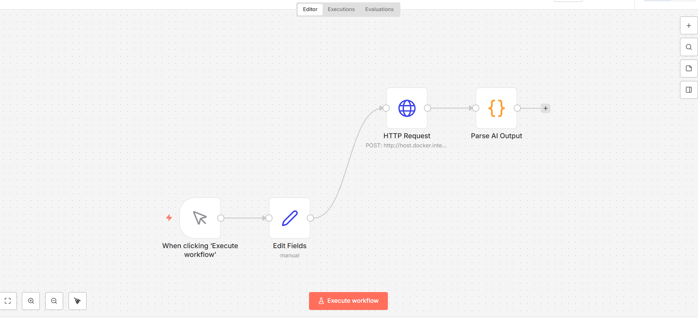

# AI Resume Evaluator (n8n + Ollama)

## 📌 Project Overview
This project is an AI-powered resume evaluation system built using **n8n automation**, **Ollama local LLMs**, and **custom JavaScript parsing**.

It analyzes resume content against job requirements and produces:
- ATS score
- Shortlist decision
- Explanation / reasoning

The system runs fully **locally**, without relying on paid APIs.

---

## 🧠 Technologies Used

- **n8n** – Workflow automation
- **Ollama** – Local LLM runtime
- **Gemma 3B** – Lightweight open-source LLM
- **JavaScript** – AI output parsing
- **HTTP APIs** – Model communication
- **Git & GitHub** – Version control

---

## 🔄 Workflow Architecture

1. User triggers workflow
2. Resume data is sent to Ollama (Gemma model)
3. Model responds in streamed / text format
4. JavaScript logic extracts structured fields
5. Final output:
   - Score
   - Shortlist decision
   - Reason

---

## 🚀 Features

- Fully local AI (no cloud cost)
- Handles non-JSON / streamed AI responses
- Production-style automation workflow
- Reusable parsing logic
- Resume & ATS friendly project

---

## 🌍 Real-World Use Cases

- Resume screening systems
- HR automation
- AI-powered hiring tools
- ATS scoring engines
- Local AI experimentation

---

## 📈 Future Enhancements

- Web dashboard (React / Streamlit)
- PDF resume upload
- Database storage
- Job description comparison
- Real-time API endpoint

---

## 📂 Project Structure

AI-RESUME-EVALUATOR-N8N
├── workflow
│ └── n8n-workflow.json
├── parsing
│ └── parse_ai_output.js
├── docs
└── README.md
---

## 🖼 Workflow Diagram

This diagram shows how resume data flows through n8n, Ollama, and the parsing logic.
